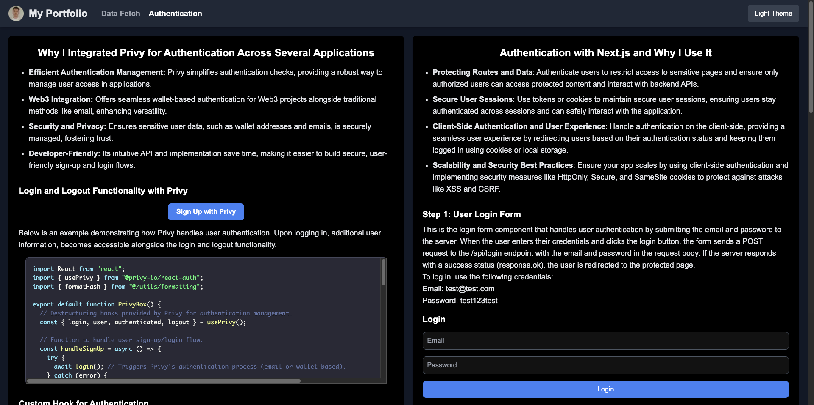
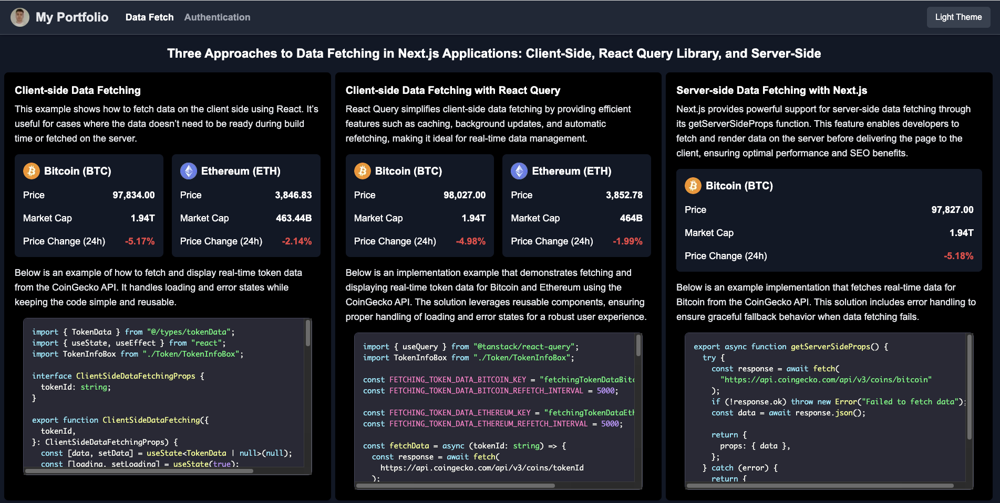

# **My Portfolio (WIP)**

A personal portfolio built with **Next.js**, **Tailwind CSS**, and **TypeScript**. This application for now showcases different authentication methods (with Privy and Next.js) and data-fetching techniques (Client-side, Server-side, and React Query).

---

## 🛠️ **Features**

- 🔐 **Authentication**: Two types of authentication implemented—one using **Privy** and the other with **Next.js**.  
- 🔄 **Data Fetching**:  
  - **Client-side**: Fetching data on the client with React hooks.  
  - **Server-side**: Fetching data on the server using Next.js's `getServerSideProps`.  
  - **React Query**: Fetching and caching data with **React Query**.  

---

## 🖼️ **Screenshots**

### **Home Page (Coming Soon)**

### **Auth Page**  

### **Data Fetching Page**  

---

## 🔧 **Technologies Used**

- **Next.js**: React framework used for routing and project structure.  
- **Tailwind CSS**: Utility-first CSS framework for styling.  
- **TypeScript**: Static typing for improved code quality.  
- **Privy**: Privacy-first authentication for web3 apps.  
- **React Query**: Data fetching and caching library.  
- **Vercel**: Hosting and deployment platform.

---

## 🚀 **Getting Started**

### **Prerequisites**
Make sure you have **Node.js** and **npm/yarn** installed.

### **Installation**
1. Clone the repository:  
   
bash
   git clone https://github.com/ndim99/my-portfolio
   cd my-portfolio

2. Install dependencies:  
   
bash
   npm install
   # or
   yarn install

### **Development Server**
Start the development server:  
bash
npm run dev
# or
yarn dev

Visit [http://localhost:3000](http://localhost:3000) in your browser to view the application.

### **Build for Production**
To create a production build:  
bash
npm run build
npm run start

---

## 📚 **Learn More**

To learn more about the tools and frameworks used in this project, check out:  
- [Next.js Documentation](https://nextjs.org/docs)  
- [Tailwind CSS Documentation](https://tailwindcss.com/docs)  
- [React Query Documentation](https://tanstack.com/query)  
- [Privy Documentation](https://privy.io/docs)  

---

## 📤 **Deploying on Vercel**

To deploy this project on Vercel:  
1. Push your repository to GitHub.  
2. Link the repository to [Vercel](https://vercel.com/).  
3. Configure the build settings (npm run build).  
4. Deploy the project.

---

## 🧑‍💻 **Author**

Developed by [Nikola](https://github.com/ndim99).

---